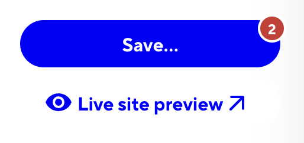

# Editing your website

Editing the content of you website, can be done in two ways:

- Using the CloudCannon web interface
- Using a local text editor and git

this document will explain both methods in detail

- [Using the CloudCannon web interface](#using-the-cloudcannon-web-interface)
  - [Create a new CloudCannon account and sign up for a plan](#create-a-new-cloudcannon-account-and-sign-up-for-a-plan)
  - [Click on the website you want to edit](#click-on-the-website-you-want-to-edit)
  - [Testing your changes](#testing-your-changes)
  - [Publishing your changes](#publishing-your-changes)
- [Using a local text editor and git](#using-a-local-text-editor-and-git)
  - [prerequisites](#prerequisites)
  - [installation](#installation)
  - [Editing the content](#editing-the-content)
  - [adding an image](#adding-an-image)
  - [Publishing your changes](#publishing-your-changes-1)

For a visual comparison of the two methods, watch [this playlist](https://acostudio-my.sharepoint.com/:l:/g/personal/vadim_acostudio_be/FO-XpAqKuO9Gs6qjrHJG1zQBxqpjACPMbr_EjGptcIl7Fw?e=4zTA77)
(use a microsoft account to access the videos)

## Using the CloudCannon web interface

### Create a new CloudCannon account and sign up for a plan

You have two options, depending on you specific needs:

    - Lite 10,- USD/month (1 user, deploy via Github)
    - Standard 49,- USD/month (3 users, deploy via CloudCannon)

The only important difference between the two plans is the number of users and the deployment method. The Lite plan is sufficient for most users.

With the Lite plan, you would deploy your website by creating a pull-request on Github, instead of a dedicated "publish" button in CloudCannon.

### Click on the website you want to edit

With the CloudCannon user interface, you can edit the content of your website directly in the browser. You can add new pages, edit existing pages, and upload images. Once you are done, click save to your changes

### Testing your changes

You can preview your changes by clicking on the "Preview" button in the top right corner. This will open a new tab with your website. You can also use the "Preview" button to see how your website will look on different devices.



### Publishing your changes

- lite plan: Create a pull-request on Github, and merge your changes from the `develop` branch to `main`
- standard plan: Click on the "Publish" button in the top right corner

## Using a local text editor and git

### prerequisites

- Install git on your computer
- Install a text editor (e.g. Visual Studio Code)
- install node.js and npm (node version >= 20.0.0)

### installation

1. Clone the repository to your computer, clone this repository to your computer by running the following command in your terminal:

```bash
git clone <the-url-of-this-repository>
```

2. Install the dependencies by running the following command in your terminal:

```bash
npm install
```

3. Start the development server by running the following command in your terminal:

```bash
npm run dev
```

4. Open your browser and go to `http://localhost:3000` to see your website.

### Editing the content

You can edit the content of your website by editing the markdown files in the `content` folder. Once you are done, save your changes and refresh the browser to see the changes.

the content folder will be structured like this

> the folder structure is fixad and important, as it determines the structure of your website. The files below are just examples, you can add more files and name them as you like

```
content
├── news
│   ├── 2022-01-01-my-first-news-article.md
│   └── 2022-01-02-my-second-news-article.md
├── events
│   ├── 2022-01-01-my-first-event.md
│   └── 2022-01-02-my-second-event.md

```

> File names will be used as the URL of the page, so make sure to use a descriptive name

Each file `.md` (MarkDown) file is a page on your website. The content of the file is written in markdown, which is a simple way to write formatted text. You can learn more about markdown [here](https://www.markdownguide.org/cheat-sheet/)

These files contain metadata at the top, which is used to generate the page. The metadata is written in YAML, which is a simple way to write structured data. You can learn more about YAML [here](https://learnxinyminutes.com/docs/yaml/)

Here is an example of a markdown file:

```yaml
---
title: My first news article
date: 2022-01-01
---
# My first news article
lorem ipsum dolor sit amet, consectetur adipiscing elit. Sed do eiusmod tempor incididunt ut labore et dolore magna aliqua. Ut enim ad minim veniam, quis nostrud exercitation ullamco laboris nisi ut aliquip ex ea commodo consequat. Duis aute irure dolor in reprehenderit in voluptate velit esse cillum dolore eu fugiat nulla pariatur. Excepteur sint occaecat cupidatat non proident, sunt in culpa qui officia deserunt mollit anim id est laborum.
```

### adding an image

If you want to add an image to your page, you can do so by adding the image to the `public` folder and then linking to it in your markdown file. Here is an example:

```markdown

```

your image will then be in:

```
public
└── news
    └── our-team.jpg
```

an image can be added, inline with the rest of the content of your page. Or it can be added as part of the metadata, fe. to add cover images for news articles like this:

```yaml
---
title: My first news article
date: 2022-01-01
cover_image: /news/our-team.jpg
---
... content of the news artile
```

### testing your changes

You can test your changes by running the development server and opening your browser to `http://localhost:3000`. You can also test how your website will look on different devices by resizing your browser window.

To open the development server, run the following command in your terminal:

```bash
npm run dev
```

### Publishing your changes

Once you are done editing the content of your website, you can publish your changes by:

1. Commit your changes to git, either by using a git client or by running the following command in your terminal:

```bash
git add .
git commit -m "your commit message"
```

2. Push your changes to Github by running the following command in your terminal:

```bash
git push
```

3. Create a pull-request on Github, and merge your changes from the `develop` branch to `main`

## Conclusion

This document provides an overview of how to edit the content of your website using the CloudCannon web interface and a local text editor and git. Both methods have their advantages and disadvantages, and you can choose the one that series best for you. If you have any questions or need help, feel free to reach out
